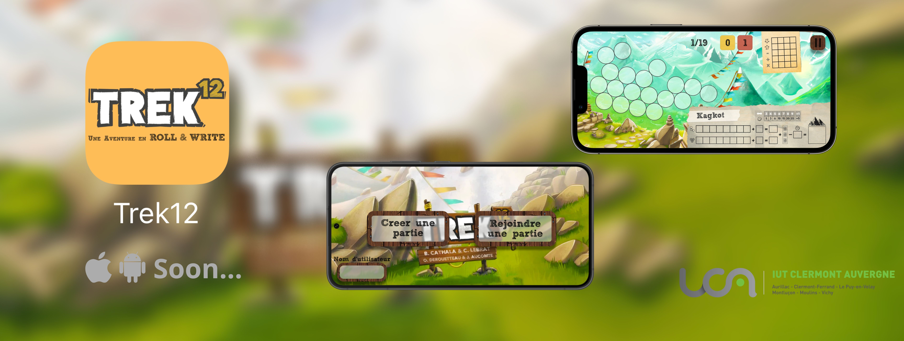
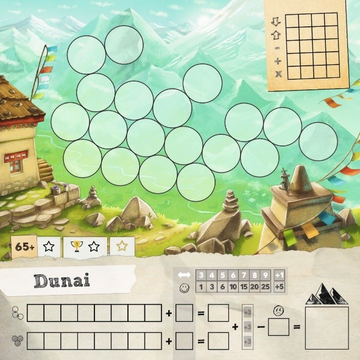
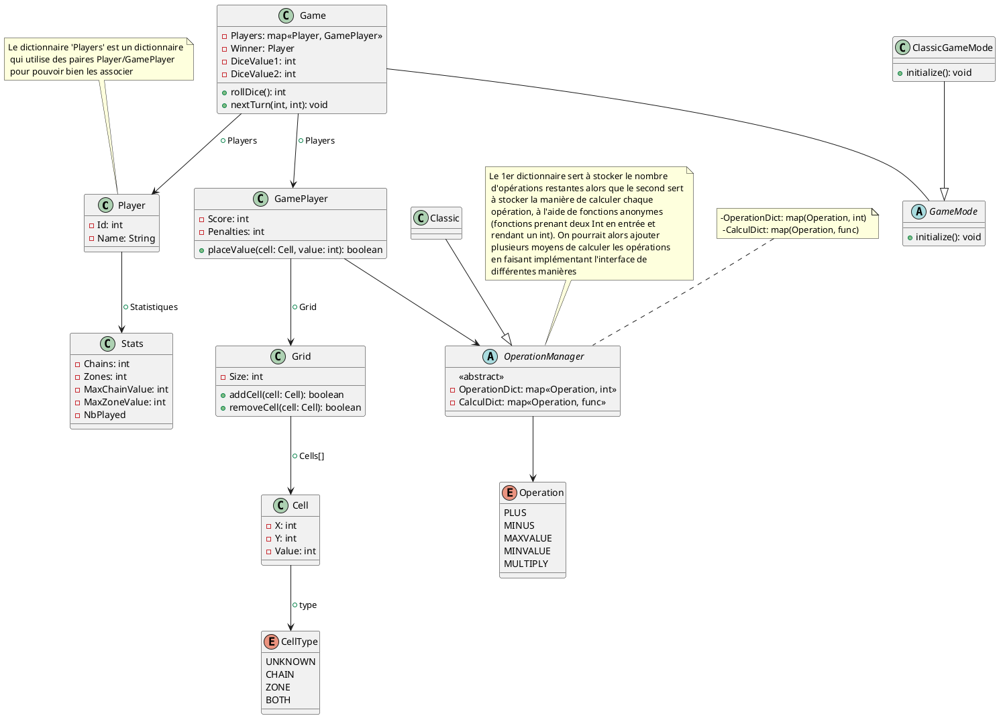

---
&nbsp; 
&nbsp; 
&nbsp; 
&nbsp; 

---

# Trek12

Le but de cette SAE sera de développer un jeu (Trek12) multi-joueurs non temps-réel en réseau (à travers code first) pour mobile et/ou web.

## Contexte

**Trek12** est un jeu de type Roll & Write créé par Bruno Cathala et Corentin Lebrat.  
Il peut être joué à plusieurs, chaque joueur possède une fiche comme celle ci-dessous.  
Une partie est faite de 19 tours.  
Un lancer de deux dés est réalisé (le même pour tous les joueurs) à chaque tour : les deux possèdent 6 faces, mais le premier va de 0 à 5 et le deuxième de 1 à 6.  
Chaque joueur peut choisir l'une des opérations suivantes :
- prendre la plus petite valeur des deux dés,
- prendre la plus grande valeur des deux dés,  
- faire la soustraction des deux dés,
- faire l'addition des deux dés,
- faire le produit des deux dés.  
  
Attention, chaque opération ne peut être utilisée que 4 fois pendant une partie.  
Les valeurs obtenues sont ensuite placées dans les cercles ci-dessous et doivent être adjacentes à un cercle déjà rempli (sauf pour le premier lancer bien sûr).  
Le joueur doit ensuite relier un maximum de cases de mêmes valeurs (*blocs*) ou relier des cases dont les valeurs se suivent (*chaîne*) pour faire des points.  
Il peut ensuite prendre des points supplémentaires (bloc le plus grand, chaîne la plus longue...) ou en perdre (cases isolées...).  
Le joueur ayant fait le plus de points gagne la partie.  

Le jeu est intéressant pour de jeunes joueurs car il nécessite du calcul mental, de la logique, de l'anticipation, et présente les statistiques. Pour ces raisons, je souhaite que les calculs ne soient pas faits automatiquement mais seulement vérifiés, pour que les enfants continuent à faire leurs calculs eux-mêmes.  

## Que faut-il faire ?

L'objectif du projet est de rendre ce jeu utilisable par des jeunes à travers une application mobile (et web ?) et de permettre le jeu en réseau. Il s'agit donc d'un jeu multi-joueurs en réseau, mais non temps-réel. Il faut attendre le choix de chaque joueur pour passer au tour suivant, mais le temps n'a pas d'importance.  
Les technologies seront choisies en accord avec le tuteur.  

## Extensions possibles
- un tchat
- le stockage des résultats des parties et le classement des meilleurs joueurs.

## Diagramme de classes

